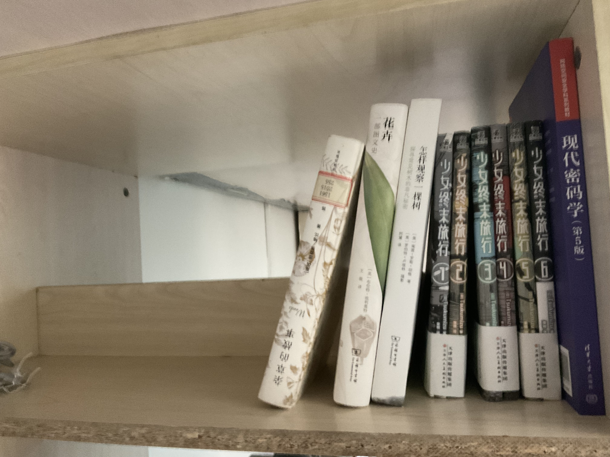
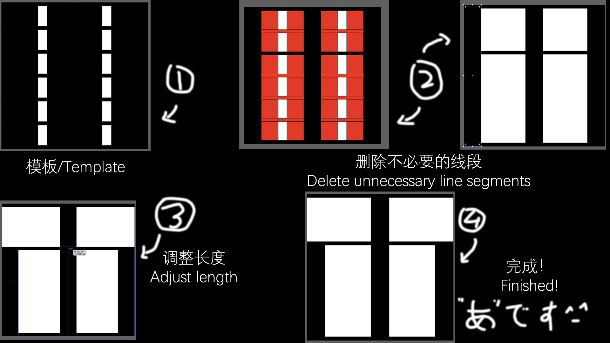
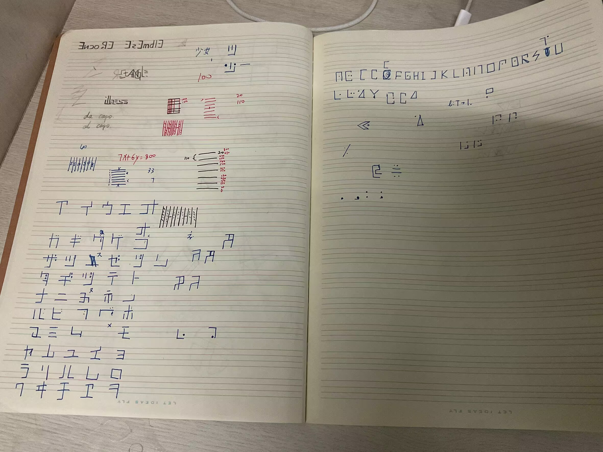
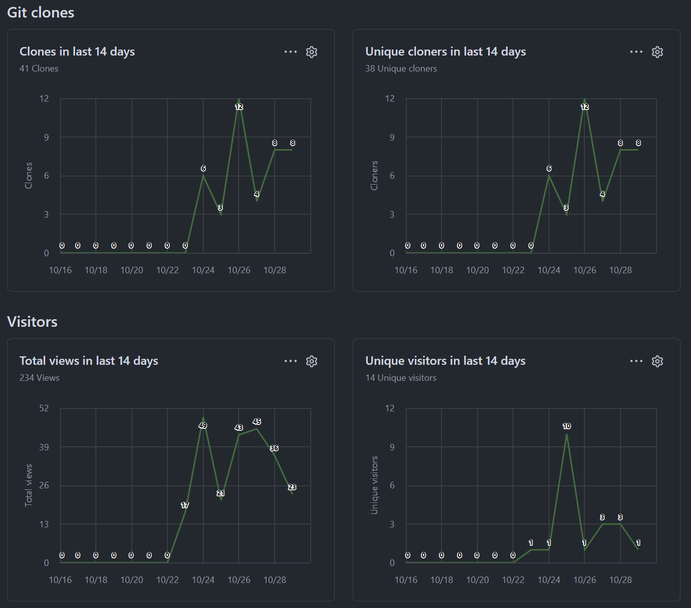
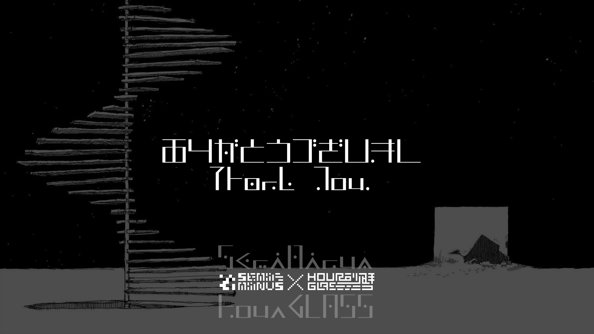

## 你如何接触到少女终末旅行的？

如果我没记错，我是因为B站的[某位UP主](https://space.bilibili.com/108745110)做了一些少末的动画。才知道少女终末旅行的。<br>
<sub>这位疫情（2020年）之前是主玩瘟疫公司自制图的，也是我了解他的原因</sub><br>
从2020年我第一次看少女终末旅行以来，我就很喜欢这部番。当然，那个时候我并没有深入了解这部番以及这部番后面的漫画。（我当时就一臭看番的）<br>
2025年春我第一次看了漫画。或者说——第一次弄到漫画。是朋友买的盗版书。看完了，有一种说不出来的感觉。<br>
然后我跟我那个朋友分开了。<br>
暑假的时候，我在我那个城市的一家书店逛的时候，看到了简体中文版的少末漫画，所以直接拿下了。<br>
<br>
<sub>虽然那一套的翻译很是问题，从观感上还不如盗版的那套——那套好歹是台版的翻译，ok？</sub><br>
<sub>那一套第四卷“千户的日记”那一部分没有翻译……写的是终末文字……</sub><br>

## 你为什么会想做这个项目？

> 我在网上找到了少末动画的设定集，其中一页吸引了我的注意。<br>
> (来自OldREADME.md)<br>

不得不提的是少末贴吧确实比较善良，有[一个帖子](https://tieba.baidu.com/p/9221977936)整理了吧里的（几乎所有）资源，想找到这些东西确实非常容易。<br>
<sub>而且这条帖子在吧里还是置顶的……伟大……</sub><br>
这就不得不让我想到之前找幸运星漫画资源的痛苦了……扯远了哈。<br>

## 这些字体是如何设计的？

我的习惯是观察这些字体的共同点，找出可以作为这些字体的模板的东西，然后开整。<br>
设定集提供的平假名设计确实可以作为线索来进行片假名的设计，小写字母的设计也可以作为大写字母的线索。<br>
因此，只要在模板上进行修改，就可以很方便地“作字”了。<br>

我可以给你们看看片假名和大写字母的设计……流程？我只是想到什么写什么而已。<br>

<sub>其实这就是我的草稿本</sub>

## 你使用了什么工具？

Adobe Illustrator 和 FontForge，Ai用来做字体的形状，ff用来生成字体。<br>
之前还使用Gothic来进行描边（方法来自[这个视频](https://www.bilibili.com/video/BV1qcWJzoEt2/)）（不过现在不用了）<br>
如果你要说，我还用了Adobe Photoshop来制作那几张预览图（不过我很懒以至于我没留源文件）<br>

## 你有使用AI吗？

有吧……（心虚）<br>
我确实使用了一点AI，但是是让它帮我写一个把.ai文件批量导出为.svg文件的程序的。<br>
其他东西都是我手搓的。<br>
如果你想看的话，这是AI写的JavaScript代码，拖进Adobe Illustrator就可以用：<br>

```
main();
function main() {
    var folder = Folder.selectDialog('Select folder');
    if (!(folder instanceof Folder)) return;
    var files = get_ai_files(folder, []);
    if (files.length == 0) {
        alert('The folder contains no AI files');
        return;
    }
    for (var i = 0; i < files.length; i++) {
        var doc = app.open(files[i]);
        var file = File(doc.fullName.fsName.replace(/\.ai$/i, '.svg'));
        doc.exportFile(file, ExportType.SVG);
        doc.close(SaveOptions.DONOTSAVECHANGES);
    }
    alert('Number of saved SVG files: ' + files.length);
}
function get_ai_files(folder, files_array) {
    var files = folder.getFiles('*');
    if (files.length == 0) return files_array;
    for (var i = 0; i < files.length; i++) {
        var file = files[i];
        if (/.+\.ai$/i.test(file.name)) files_array.push(file);
        if (file instanceof Folder) files_array.concat(get_ai_files(file, files_array));
    }
    return files_array;
}
```
<sub>没人问你，真的。</sub>

## 最后一张预览上出现的“HourGLASS”是谁？

`HourGLASS`是我的一个名义，主要用在需要设计的地方。<br>
通常我会直接使用`Semi-Minus`，但有时也会使用其他的名义。<br>
比如`HEART[WAV]E`（基本上是进行翻译的时候）、`⌈A⌋`（与其他人合作的时候）等。<br>

## 之后的计划是什么？

我？我还有很多事情要干。<br>
首先我朋友那里有一些活给我干，然后我自己也给自己找了些活。<br>
这些活都不简单，但是我尽力。<br>
<sub>顺便支持一下我朋友的项目“[Hanoi_raylib](https://github.com/Science-ch/Hanoi_raylib)”吧谢谢</sub>

## 还有什么想说的吗？

一周内这个仓库被查看了200次左右。虽然不多，但还是谢谢你们！<br>


<hr>



<hr>

Semi-Minus"半色" & HourGLASS"砂時計" 谨上。

